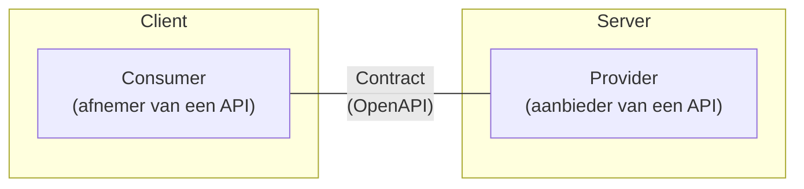

# API's

Overheidsorganisaties ontwikkelen API's om allerlei data snel, efficiënt en op
een gestandaardiseerde manier te delen met andere overheidsorganisaties en
andere partijen die met de overheid werken.

API's (Application Programming Interfaces) zijn handig omdat ze interactie
tussen verschillende softwaretoepassingen mogelijk maken. Ze dienen als een
tussenlaag die applicaties of systemen met elkaar laat communiceren, zonder dat
ze direct toegang tot elkaars broncode of onderliggende infrastructuur nodig
hebben.

## REST API's

Het meest gebruikte type API wordt een REST API genoemd. Het gebruik van REST
API's is om de volgende redenen populair geworden:

- REST API's maken gebruik van HTTP-methoden zoals `GET`, `POST`, `PUT` en
  `DELETE`, die standaard zijn in webtechnologieën. Hierdoor kunnen
  ontwikkelaars eenvoudig met een REST API werken zonder uitgebreide training.
- REST API's werken over HTTP, wat betekent dat ze kunnen worden gebruikt door
  verschillende soorten clients, zoals webapplicaties, mobiele apps en
  IoT-apparaten, ongeacht het onderliggende platform.
- REST API's maken het mogelijk om onderdelen van een systeem los te koppelen.
  Front-end en back-end kunnen onafhankelijk van elkaar worden ontwikkeld, wat
  onderhoud en innovatie vergemakkelijkt. REST API's zijn een logisch onderdeel
  van een microservices architectuur.

### Consumers en providers

In de NL API Strategie wordt er onderscheid gemaakt tussen een afnemer
(**consumer**) en aanbieder (**provider**) van API's. Tussen hen wordt een
communicatiecontract gesloten, dat we vastleggen in een **OpenAPI
specificatie**.

De term consumer is soms breder dan enkel client; het kan zijn dat de consumer
een poort moet openzetten om bijvoorbeeld een webhook te kunnen afhandelen. Dit
komt door het afnemen van het API contract van de provider. De termen worden
internationaal ook veelvuldig gebruikt, zoals bijvoorbeeld in
[consumer-driven contract testing](https://microsoft.github.io/code-with-engineering-playbook/automated-testing/cdc-testing/).

In diagrammen wordt de consumer meestal links getekend en de provider rechts.
Dit volgt de conventie waarbij we beginnen bij de initiatiefnemer: een verzoek
stroomt van links naar rechts, een antwoord van rechts naar links.

Door onderscheid te maken tussen consumers en providers, kunnen we uitspraken
doen over andere API-gerelateerde aspecten, zoals

- Versiebeheer. Welke veranderingen zijn backwards compatible, en welke zijn
  breaking?
- Eigenaarschap. Een provider is autoritatief over de API en de informatie die
  het ontsluit.
- Data lineage. Bij geschakelde microservices kan de herkomst van data worden
  herleid door de keten van consumer-provider relaties te volgen tot aan de
  oorspronkelijke, autoritatieve bron.

## Bronnen

- [Kennisplatform API's](/communities/kennisplatform-apis/)

## Aan de slag!

 
 