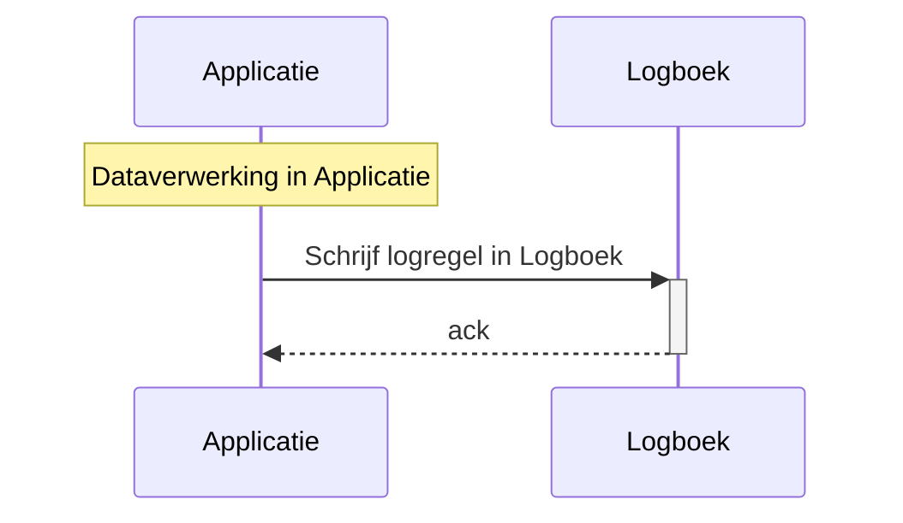
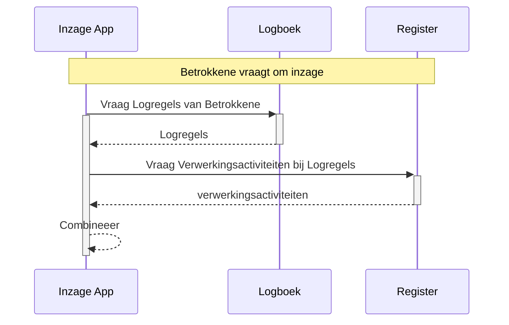

# Projectbesluiten bij totstandkoming

Deze pagina bevate (historische) afwegingen die gemaakt zijn tijdens de totstandkoming van de standaard.
Een aantal besluiten en overwegingen hebben relatie met het juridische beleidskader.
De besluiten zijn hier beschikbaar om te begrijpen waarom er bepaalde keuzes zijn gemaakt en hoe dat impact had op de standaard.

## Logregels bevatten geen gegevens die al vastliggen in een Register

Datum: 2024-02-01

### Context en probleemstelling

Om logs zo begrijpelijk mogelijk te maken is het aantrekkelijk om de benodigde informatie redundant weg te schrijven in elk logrecord, zodat er geen afhankelijkheid bestaat van andere bronnen.

Dit heeft nadelen, zoals:

- Wanneer de statische data (zoals bewaartermijn, verantwoordelijke, etc.) wijzigen, zou dit moeten worden aangepast in alle Logregels. Dat verhoudt zich slecht tot het 'inmutable' (onveranderbaar) zijn van deze Logregels.
- De grote vrijheid in alle clients om invulling te geven aan deze data leidt er vrijwel zeker toe dat verdere divergentie optreedt. Dit heeft o.a. tot gevolg dat het lastig wordt om te rapporteren uit de logs
- De API voor het wegschrijven van logs wordt ingewikkeld en relatief traag voor het wegschrijven van records
- We niet voldoen aan alle uitgangspunten die horen bij dataminimalisatie

In de gewenste situatie:

- staan alle statische data in het Register van de Verwerkingsactiviteiten (RvVA), en bevatten Logregels verwijzingen naar dat Register. Specifiek gaat dit om de resources ['verwerkingsactiviteiten'](https://logius-standaarden.github.io/logboek-dataverwerkingen/#dfn-verwerkingsactiviteiten) en 'organisaties'.
- kan bij het configureren van clients in de RvVA-API worden opgezocht welke organisaties en verwerkingsactiviten van toepassing zijn
- kunnen wijzigingen in verwerkingsactiviteiten worden doorgevoerd zonder dat Logregels gewijzigd behoeven te worden

Met name het wegschrijven van logs kan op deze manier met hogere performance worden uitgevoerd. Dit kan nog verder worden geoptimaliseerd door niet te vereisen dat dit middels REST API calls gebeurt, maar een interface te definiëren die kan worden geïmplementeerd met bijvoorbeeld gRPC of andere streaming protocollen.

Wanneer het aan de gebruiker is om in de software die de Logboek API aanroept de namen van acties, de vertrouwelijkheid en de bewaartermijn te bepalen, zal de invulling daarvan op allerlei manieren uiteen gaan lopen. Door dit in het RvVA te bepalen zal eerder uniformering plaatsvinden. De vulling van RvVA's kan waarschijnlijk zelfs in hoge mate gestandaardiseerd worden.

Met meer gestandaardiseerde namen en bewaartermijnen en een eenduidige omgang met vertrouwelijkheid is het ook eenvoudiger om eenduidige te communiceren naar de Betrokkene. Bijvoorbeeld: een portaal dat aan de Betrokkene toont hoe de persoonsdata zijn verwerkt, is lastig vorm te geven wanneer in de praktijk blijkt dat software-leveranciers verschillende interpretaties hebben van het niveau waarbij sprake is van een verwerking, handeling of actie. Eenduidige interpretatie is cruciaal, en dit kan waarschijnlijk alleen in het RvVA.

Overigens werkt het conceptueel wél wanneer men geen API op het RvVA aanbiedt, deze link kan ook handmatig worden gelegd iedere keer als deze informatie nodig is, en het RvVA bijvoorbeeld alleen bestaat als Excel document.

### Besluit

Logregels bevatten geen informatie over Verwerkingsactiviteiten en Verantwoordelijkheden die al vastliggen in een Register

### Gevolgen

- In de standaard Logboek Dataverwerkingen is het nodig om ook de benodigde interface op de RvVA te standaardiseren. Dit is nodig om de logs geautomatiseerd en realtime te kunnen interpreteren: zonder een gestandaardiseerde manier om informatie over verwerkingsactiviteiten op te vragen kan men aan logregels niet zien of het verwerkingen, handelingen of acties betreft.

Met de volgende sequentie diagrammen wordt in beeld gebracht wat de gevolgen zijn voor de diverse flows in het gebruik van de standaard.

#### Loggen van een verwerking

Het wegschrijven van een verwerking in de log-API is uiterst simpel:

Deze transactie is geoptimaliseerd op eenvoud en snelheid, want deze heeft rechtstreeks invloed op de snelheid van verwerkingen. Deze transactie moet schaalbaar zijn naar bijv. tienduizenden transacties per seconde.

#### Tonen van een verwerking

Om verwerkingen op een significante manier te tonen aan bijvoorbeeld een Betrokkene, is het noodzakelijk om data op te vragen uit zowel de logs als het RvVA. Deze flow mag wat complexer zijn, omdat deze niet voor alle vastgelegde data wordt uitgevoerd en het belang van de bevraging rechtvaardigt dat een bevraging wat langer kan duren.

## Logregels bevatten alleen wat nodig is voor verantwoording door verantwoordelijke

Datum: 2024-06-24

### Context en probleemstelling

Vanuit de wens om zoveel mogelijk context vast te leggen om zo een compleet beeld te schetsen van wat er is gebeurd rond een [Dataverwerking](https://logius-standaarden.github.io/logboek-dataverwerkingen/#dfn-dataverwerkingen) kan  de neiging ontstaan om informatie uit andere organisaties vast te leggen in de logregels.

Hierdoor kom je (juridisch gezien) al snel in lastig vaarwater. Er worden dan zaken vastgelegd die niet noodzakelijk zijn voor het verantwoorden van het handelen. Het is namelijk mogelijk om een compleet beeld te krijgen door de informatie te laten in de organisatie waar een dataverwerking is uitgevoerd. Vanuit het oogpunt van dataminimalisatie is dit een betere oplossing.

Voor de uitoefening van het Inzagerecht is de consequentie dat de Betrokkene informatie uit alle organisaties moet ophalen en deze volgens een paar relatief eenvoudige businessrules aan elkaar moet relateren voor het verkrijgen van een compleet beeld. Dit kan door alle organisaties te bevragen, of door gericht bij één organisatie te beginnen en vervolgens de [URI's](https://datatracker.ietf.org/doc/html/rfc3986) te volgen naar Logregels in andere organisaties.

Het kan zijn dat organisatie A de logs wel op orde heeft, en organisatie B (nog) niet. Dan is het resultaat dat geen compleet beeld kan worden gegeven. Daarmee komt de prikkel tot verbetering op de juiste plek, namelijk bij de organisatie die het Logboek nog niet op orde heeft.

### Besluit

Logregels bevatten alleen wat nodig is voor verantwoording door de Verantwoordelijke.

### Gevolgen

- In logregels wordt alleen een identifier vastgelegd van gerelateerde Dataverwerkingen in een andere context (bijv. een andere organisatie), geen inhoudelijke informatie
- Voor een analyse, bijvoorbeeld in het kader van een audit of uitoefening inzagerecht, is het nodig om op dat moment de URI's naar logs in andere organisaties te volgen

## Bewaartermijnen worden in het Profiel vastgelegd

Datum: 2024-05-23

### Context en probleemstelling

Logregels moeten op enig moment worden verwijderd. Wanneer?

Voor vrijwel alle vastgelegde data geldt dat deze op enig moment moeten worden vernietigd of overgebracht naar een archief. Dit geldt ook voor Logregels.

Anders dan bij data over rechtsfeiten zullen Logregels typisch allemaal dezelfde bewaartermijn hebben. Het kan zijn dat de Dataverwerking waar het logrecord betrekking op heeft leidt tot data waarvoor complexe bewaartermijnen gelden (bijvoorbeeld een dynamische termijn die duurt totdat Betrokkene is overleden gevolgd door een statische termijn van enkele tientallen jaren). De Logregels die de Dataverwerking beschrijven kennen deze complexe bewaartermijn niet, deze kunnen statisch zijn en generiek worden vastgesteld per organisatie of eventueel per verwerkingsactiviteit. Het is aan de organisatie zelf om daarin keuzes te maken.

Voor samenwerkende organisaties die zich ten doel stellen om gezamenlijk op eenduidige manier te verantwoorden over dataverwerkingen kan het nuttig zijn afspraken voor bewaartermijnen vast te leggen in een Profiel.

### Besluit

Bewaartermijnen worden in het Profiel vastgelegd.

### Gevolgen

- In de Logregel liggen geen data vast over bewaartermijnen.
- Vanuit een beheercomponent (een applicatie die functionaliteit biedt voor beheren van logboek. Is een kwestie van implementatie en valt buiten scope van deze standaard) kunnen Logregels worden verwijderd door te kijken naar de datum van de Logregel in relatie tot de bewaartermijn die de organisatie hanteert voor Logregels. Deze bewaartermijn kan gezamenlijk zijn afgesproken en ligt dan vast in het Profiel.

## Geen data over gebruikers in logregels

Datum: 2024-05-23

### Context en probleemstelling

Om te verantwoorden dat een dataverwerking correct is uitgevoerd is het nodig te weten wie de dataverwerking heeft geïnitieerd, zodat kan worden nagegaan dat dit met de juiste autorisatie is gedaan.

De wens zou kunnen bestaan om in elke logregel vast te leggen welke gebruiker een rol heeft gehad bij de betreffende Dataverwerking.

Echter, de vastlegging van een handeling van een gebruiker als medewerker van een organisatie betreft ook een Dataverwerking die onder de AVG valt, waardoor rechten ontstaan voor de betreffende gebruiker om Inzage te verkrijgen. De vastlegging van de betrokkenheid van de gebruiker is een Dataverwerking op zich. Door een dergelijke vastlegging in de logregels te doen ontstaat een ongewenste recursiviteit.

Ook is de relatie van de gebruiker tot de Dataverwerking niet eenvoudig eenduidig te modelleren, o.a. omdat bij een enkele Dataverwerking meerdere gebruikers in meerdere rollen betrokken kunnen zijn.

Daarnaast kan het goed zijn dat de Dataverwerking in het Audit Log (Een log file die activiteiten van gebruikers, uitzonderingen en informatiebeveiligingsgebeurtenissen vastgelegd. Dit is o.a. vanuit BIO verplicht) onder een andere Verantwoordelijke valt dan de Dataverwerking die op dat moment door de gebruiker wordt uitgevoerd. Bijvoorbeeld:

- Een Dataverwerking wordt door een gebruiker bij een [Verwerker](https://logius-standaarden.github.io/logboek-dataverwerkingen/#dfn-verwerkers) uitgevoerd
- De Dataverwerking valt onder verantwoordelijkheid van de [Verantwoordelijke](https://logius-standaarden.github.io/logboek-dataverwerkingen/#dfn-verantwoordelijke), namelijk de organisatie die de Verwerker heeft ingehuurd
- De Audit Log is een aparte Dataverwerking die valt onder verantwoordelijkheid van de Verwerker, in de rol van Verantwoordelijke over de eigen bedrijfsvoering.

Het is daarom zuiverder om een andere oplossing te kiezen, namelijk:

- Betrokkenheid van gebruiker wordt vastgelegd in een Audit Log (buiten scope van deze standaard)
- In het Audit Log kan eventueel een relatie worden gelegd met het Processing ID dat ook in het Logboek Dataverwerkingen wordt gebruikt
- Iedere keer dat in het Audit Log data over een gebruiker worden vastgelegd, moet tevens een Dataverwerking worden gelogd in het Logboek Dataverwerkingen.

Let wel, deze Dataverwerking is een *andere Dataverwerking* dan de Dataverwerking die op dat moment wordt uitgevoerd door de Gebruiker, heeft een eigen Trace Context, en wordt gerelateerd aan een andere Verwerkingsactiviteit.

### Besluit

In logregels worden geen identificerende data over gebruikers van de Applicaties vastgelegd.

### Gevolgen

- In gevallen dat het nodig is te achterhalen welke gebruiker een specifieke Dataverwerking heeft uitgevoerd, moet dit worden achterhaald door de Dataverwerking te koppelen aan het Audit Log (buiten scope van de standaard).
- Het koppelen van Dataverwerking aan Audit Log is mogelijk door in Audit Logs hetzelfde Processing ID op te nemen als in de logregel die in het Logboek Dataverwerkingen wordt opgenomen.

## Standaard beschrijft geen interface voor verwijderen van logs

Datum: 2024-05-24

### Context en probleemstelling

Logregels moeten op enig moment worden vernietigd. Moet er een interface in de standaard worden gedefinieerd voor het verwijderen van vastgelegde Logregels?

De wijze waarop Logregels worden weggeschreven is sterk afhankelijk van de keuzes die een organisatie maakt bij de implementatie van de standaard.

Interoperabiliteit is daarbij niet relevant, omdat het wijzigen of verwijderen van Logregels niet gebeurt vanuit de applicatie die oorspronkelijk de dataverwerking uitvoerde en het wegschrijven van het logrecord veroorzaakte. Wijzigen en verwijderen gebeurt vanuit een beheercomponent. Deze zijn vaak hard gekoppeld aan de voor logging gekozen oplossing, waardoor het voorschrijven van een interface tot onnodige complexiteit leidt.

### Besluit

- De standaard beschrijft geen interface voor het wijzigen of verwijderen van Logregels

### Gevolgen

- Iedere organisatie kan een bij de eigen implementatie passende oplossing kiezen voor het verwijderen van Logregels
- Het wijzigen van Logregels is in principe ongewenst maar kan op soortgelijke manier opgelost worden

## Vertrouwelijkheid wordt vastgelegd per Verwerkingsactiviteit

Datum: 2024-05-23

### Context en probleemstelling

Alle verwerkingen worden gelogd. Een deel van deze verwerkingen mag bekend worden bij Betrokkenen, een deel niet. Hoe moet dit onderscheid geïmplementeerd worden?

Voorbeeld:

- Opsporingsinstantie A bevraagt bij Overheidsorgaan B data op over Betrokkene X in het kader van opsporingsactiviteiten rond een misdrijf
- Betrokkene krijgt geen inzage in / wordt niet geïnformeerd over de verwerking van Opsporingsinstantie A, dit zou het onderzoek hinderen
- Als Betrokkene wel inzage krijgt / wordt geïnformeerd over de verwerking van Overheidsorgaan B, zou Betrokkene alsnog zien dat Opsporingsinstantie A deze data heeft opgevraagd, met hetzelfde ongewenste effect.

Er zijn meerdere oplossingen denkbaar. Wat is de gewenste oplossingsrichting, hoe wordt deze gespecificeerd?

Mogelijke oplossingsrichtingen:

1. Ken aan iedere Dataverwerking een status toe waarmee de vertrouwelijkheid wordt aangeduid, en geef deze status mee in de verwerking zodat alle betrokken organisaties dit in de logs kunnen verwerken
2. Leg vertrouwelijkheid meer categorisch vast op het niveau van Verwerkingsactiviteiten (in het Register)

Overwegingen:

Vertrouwelijke verwerkingen moeten meer strikt gescheiden moeten worden van niet-vertrouwelijke verwerkingen. Als een bevraging zowel vertrouwelijk als niet-vertrouwelijk kan zijn, zoals bij het opvragen van eigenaardata van een voertuig, moeten hiervoor twee gescheiden processen bestaan. De vertrouwelijke variant moet apart worden gelogd en aan strengere regels voldoen. Dit omvat bijvoorbeeld eisen aan betrokken beheerders, de classificatie van data en andere specifieke voorschriften.

Pogingen om het geschetste probleem op te lossen door op logrecord-niveau vast te leggen of een verwerking vertrouwelijk is leiden tot veel complexiteit en uitzonderingsgevallen in de implemenentatie van de standaard. Een aantal voorbeelden van ongewenste complexiteit:

- Vertrouwelijkheid vastleggen per logrecord betekent dat deze vertrouwelijkheid ook moet kunnen worden opgeheven
- Logregels zijn dan niet langer 'immutable' tenzij ingewikkelde constructies worden gekozen waarbij een logrecord logisch wordt vervangen door een nieuw record toe te voegen
- Er zou een interface gedefinieerd moeten worden voor het wijzigen van de status 'vertrouwelijkheid'
- Vertrouwelijkheid van een handeling aan het einde van een proces zou gevolgen kunnen hebben voor reeds vastgelegde Logregels

Bovendien geldt dat Overheidsorganisatie B op impliciete wijze zou leren dat Betrokkene X onderwerp is van een opsporingsonderzoek, terwijl dit beter op expliciete wijze geregeld kan worden. Door het expliciet te regelen kan Overheidsorganisatie B alle benodigde maatregelen nemen om te zorgen dat de vertrouwelijkheid ook in die organisatie geborgd is.

### Besluit

Vertrouwelijkheid wordt vastgelegd per Verwerkingsactiviteit

### Gevolgen

- Vertrouwelijkheid wordt niet vastgelegd in Logregels
- Vertrouwelijkheid wordt per logrecord afgeleid uit wat over vertrouwelijkheid is vastgelegd bij de bijbehorende Verwerkingsactiviteit
- Vertrouwelijkheid wordt NIET uitgewisseld tussen organisaties
- Wanneer een verwerking niet langer vertrouwelijk is, bijvoorbeeld na verjaring, dan volgt dit uit data die vastliggen in het Register (bijvoorbeeld status vertrouwelijkheid, duur vertrouwelijkheid) en wat vastligt in een logrecord (verwerkingsactiviteit_id en datum)
- Organisaties moeten vooraf borgen dat vertrouwelijke Dataverwerkingen worden uitgevoerd op een manier die verantwoord kan worden, door dit te regelen op het niveau van Verwerkingsactiviteit. Dit kan tot gevolg hebben dat twee aparte processen nodig zijn voor het vertrouwelijk en niet-vertrouwelijk opvragen van gegevens.

## Verwijzingen naar Registers zijn zo los mogelijk

Datum: 2024-05-24

### Context en probleemstelling

In de Logregels staat zo min mogelijk inhoudelijke informatie. Informatie over verwerkingsactiviteiten ligt vast in specifieke registers.

- Er kunnen meerdere van deze Registers zijn
- Deze kunnen ook van andere organisaties zijn
- Naar welk Register wordt verwezen is afhankelijk van het type dataverwerking. Verwerkingen in het kader van de Algemene Verordening Gegevensbescherming (AVG) verwijzen naar een Register van Verwerkingsactiviteiten zoals beschreven in AVG art. 30.
- Het Register van Verwerkingsactiviteiten (RvVA) is voor veel organisaties verplicht vanuit AVG art. 30, echter niet voor alle organisaties
- Als een Register bestaat, betekent dit niet dat het ook ontsloten wordt met eeen API. In de huidige praktijk bestaat het vaak alleen in een statisch document.

De standaard voor logging moet functioneren gegeven bovenstaande feiten.

### Besluit

De link naar de uitwerking van een verwerkingsactiviteit bestaat uit een *identifier* en daarnaast een URI, URL of URN, in de vorm van *key value pairs*. Eventuele nadere invulling voor het verwijzen naar specifieke Registers (zoals het RvVA) wordt uitgewerkt in extensies.

### Gevolgen

Door de verwijzingen naar de registers los te houden van de Registers wordt voorkomen dat er in de logs directe afhankelijkheden ontstaan van de registers.

## Log Sampling is niet toegestaan

Datum: 2024-06-20

### Context en probleemstelling

Een bij logging veelgebruikte techniek is het zogenaamde 'Log Samplen', waarbij bijvoorbeeld slechts 1 op de 10 of 1 op de 100 acties die een log zouden veroorzaken daadwerkelijk worden weggeschreven. Dit wordt gedaan uit overwegingen van performance, opslagruimte en/of kosten. Voor veel toepassingen is het voldoende om uit deze logs trends te destilleren om zo fouten op te sporen of voorstellen voor verbetering te kunnen doen.

Wanneer dit zou worden toegepast bij onderhanden standaard, zou kunnen worden betoogd dat verantwoording nog altijd slaagt, omdat data voor een relevante, gerandomiseerde steekproef beschikbaar is. Echter, gelet op het belang van de verantwoording, en de wettelijke verplichtingen waaraan met de standaard invulling wordt gegeven, is dit onwenselijk voor het Logboek Dataverwerkingen. De Logregels vormen o.a. de basis voor de Informatieplicht en het Inzagerecht uit de AVG. Daarvoor is het nodig om over iedere Dataverwerking metadata vast te leggen.

### Besluit

Log Sampling is niet toegestaan.

### Gevolgen

- Iedere logregel wordt weggeschreven in het LogBoek Dataverwerkingen
- Wanneer een techniek voor loggen wordt toegepast waarbij Log Sampling is ingericht, moet ervoor worden gewaakt dat dit niet geldt voor de logregels die beschreven worden in deze standaard.

## Pseudonimiseren data

Datum: 2024-12-04

### Context en probleemstelling

Bij vastleggen betrokkene wordt in veel gevallen een BSN vastgelegd, of een ander nummer bijvoorbeeld vreemdelingennummer of objectnummer. Wanneer we inhoud van verwerkte data-objecten gaan vastleggen dan betreft dat ook dit soort data. Uit wet en regelgeving (bijvoorbeeld AVG) volgt dat pseudonimiseren wenselijk is.

Moeten we in de standaard beschrijven hoe men pseudonimisering moet aanpakken?

### Overwegingen:

- Pseudonimisering en het weer 'ont-pseudonimiseren' is iets wat binnen de organisatie relevant is, om onder andere de inzage-API te kunnen laten functioneren.

- Het is niet nodig om pseudoniemen buiten de grenzen van de organisatie uit te wisselen.

- Als burger Inzage-API's gebruikt, bestaat dat uit een reeks achtereenvolgende calls met organisaties waaruit client-side wordt afgeleid hoe het een en ander zich tot elkaar verhoudt.

- Door organisaties vrij te laten in hun implementatie, is het eenvoudiger om de standaard te implementeren.

- Pseudonimiseren is ook relevant buiten deze standaard, daarom kunnen we niet in deze standaard definiëren hoe het geïmplementeerd moet worden. 

### Besluit

- Juridisch is het pseudonimiseren van data niet VERPLICHT. Er is een verplichting om persoonsdata adequaat te beveiligen. Pseudonimisering is een mogelijke maatregel. We kiezen daarom voor een AANBEVELING in plaats van een VERPLICHTING.

- In de standaard zetten we de aanbeveling om te standaardiseren, waarbij de implementatie aan de organisatie is ("Het is AANBEVOLEN om ...").

## `foreign_trace_id` wordt niet meer opgeslagen

Datum: 2025-08-15

### Context en probleemstelling

Tijdens de workshop casus met  RINIS is gebleken dat het veld `foreign_trace_id` overbodig is en geen praktische toepassing kent binnen de standaard. Dit inzicht heeft geleid tot heroverweging van de noodzaak ervan.

### Besluit

- `foreign_trace_id` wordt **niet** meer opgeslagen

### Gevolgen

- De aangeroepen organisatie (verwerker) krijg als `trace_id` de `trace_id` van de aanroepende organisatie (verantwoordelijke)
- `foreign_span_id` wordt wel opgeslagen
- De aangeroepen organisatie (verwerker) krijgt een eigen `span_id` per activiteit