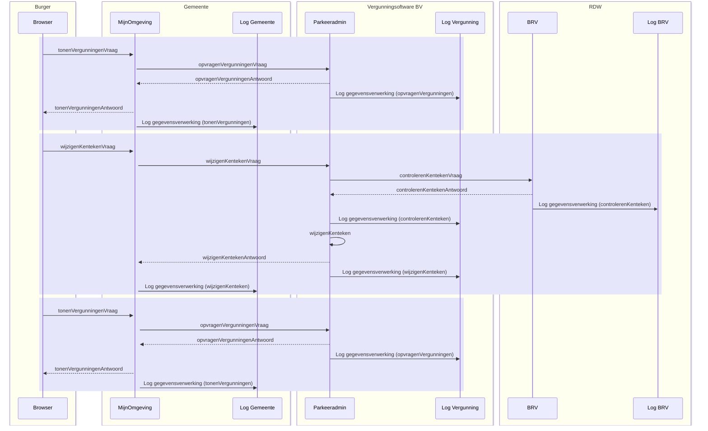

# Parkeervergunning - wijzigen

Een persoon heeft bij een gemeente een parkeervergunning in gebruik en wil de
data van het kenteken van deze vergunning wijzigen.

## Uitgangspunten

- Het beschreven proces is een voorbeeld, het werkelijke proces kan anders
  verlopen.
- Het proces is een 'happy flow', dit betekent dat validaties en eventuele
  foutsituaties in dit voorbeeld niet in ogenschouw worden genomen.
- Autorisatieprocessen zijn in dit voorbeeld niet meegenomen.
- Een Loggingsregel wordt toegevoegd aan het logboek per **geheel** afgeronde
  transactie. Er wordt dus **geen** aparte logregel aangemaakt per ontvangen of
  verstuurd bericht.

## Globaal proces

1. Een persoon vraagt in zijn 'MijnOmgeving' van de gemeente om de bestaande
   parkeervergunningdata.
2. De 'MijnOmgeving' van de gemeente verzoekt de parkeervergunningapplicatie om
   de actuele parkeervergunningdata van de persoon.
3. De parkeervergunningapplicatie voert dit verzoek uit. Daarna verzendt de
   parkeervergunningapplicatie de gevraagde data naar de gemeente. De
   parkeervergunningapplicatie logt dat er data verzonden is naar de gemeente.
4. De gemeente toont de data aan de persoon en logt dat deze data is getoond aan
   de persoon.
5. De persoon wijzigt het kenteken in de 'MijnOmgeving' van de gemeente.
6. De 'MijnOmgeving' van de gemeente verzoekt de parkeervergunningapplicatie om
   de wijziging af te handelen.
7. De parkeervergunningapplicatie verzoekt het RDW te controleren of het
   kenteken ook daadwerkelijk bij de persoon hoort.
8. Het RDW stuurt een antwoord terug naar de parkeervergunningapplicatie en logt
   de dataverwerking.
9. De parkeervergunningapplicatie logt het controleverzoek aan het RDW.
10. De parkeervergunningapplicatie wijzigt het kenteken van de persoon en logt
    het wijzigingsverzoek van de persoon.
11. Nadat de wijziging is gedaan in de parkeervergunningapplicatie, wordt het
    wijzigingsverzoek gelogd in de 'MijnOmgeving' van de gemeente.
12. De persoon vraagt in zijn 'MijnOmgeving' van de gemeente om de bestaande
    parkeervergunningdata.
13. De 'MijnOmgeving' van de gemeente verzoekt de parkeervergunningapplicatie om
    de actuele parkeervergunningdata van de persoon.
14. De parkeervergunningapplicatie voert dit verzoek uit. Daarna verzendt de
    parkeervergunningapplicatie de gevraagde data naar de gemeente. De
    parkeervergunningapplicatie logt dat er data verzonden zijn naar de
    gemeente.
15. De gemeente toont de data aan de persoon en logt dat deze data is getoond
    aan de persoon.

Schematisch ziet dit proces er als volgt uit:

## Logging van data

De volgende data worden gelogd in de diverse logmomenten:

- **Log opvragenVergunningen (log vergunningenapplicatie)**

  | Attribuut                   | Waarde                               |
  | --------------------------- | ------------------------------------ |
  | `span_id`                   | 8ee7b01aca8d01d9                     |
  | `name`                      | opvragenVergunningen                 |
  | `parent_span_id`            | `<leeg>`                             |
  | `trace_id`                  | c6adf4df949d03c662b53e95debdc411     |
  | `start_time`                | 2024-07-29 08:16:49.000              |
  | `end_time`                  | 2024-07-29 08:16:49.000              |
  | `status_code`               | OK                                   |
  | resource.name               | Parkeeradmin                         |
  | resource.version            | 2.1.6                                |
  | attributeKey                | `dpl.core.processing_activity_id`    |
  | attributeValue              | 12f2ec2a-0cc4-3541-9ae6-219a178fcfe4 |
  | attributeKey                | `<leeg>`                             |
  | attributeValue              | `<leeg>`                             |
  | `foreign_operation.span_id` | b2e339a595246e01                     |

- **Log tonenVergunningen (log gemeente)**

  | Attribuut        | Waarde                               |
  | ---------------- | ------------------------------------ |
  | `span_id`        | b2e339a595246e01                     |
  | `name`           | tonenVergunningen                    |
  | `parent_span_id` | `<leeg>`                             |
  | `trace_id`       | c6adf4df949d03c662b53e95debdc411     |
  | `start_time`     | 2024-07-29 10:16:49.690              |
  | `end_time`       | 2024-07-29 10:16:49.723              |
  | `status_code`    | OK                                   |
  | resource.name    | MijnOmgeving                         |
  | resource.version | 1.0.5                                |
  | attributeKey     | `dpl.core.processing_activity_id`    |
  | attributeValue   | 11x2ec2a-0774-3541-9b16-21ba179fcf15 |
  | attributeKey     | `dpl.core.data_subject_id`           |
  | attributeValue   | 13j2ec27-0cc4-3541-9av6-219a178fcfe5 |

- **Log controlerenKenteken (log RDW)**

  | Attribuut                           | Waarde                               |
  | ----------------------------------- | ------------------------------------ |
  | `span_id`                           | 433f276975204ccf                     |
  | `name`                              | controlerenKenteken                  |
  | `parent_span_id`controlerenKenteken | `<leeg>`                             |
  | `trace_id`                          | c6adf4df949d03c662b53e95debdc411     |
  | `start_time`                        | 2024-07-29 08:17:02                  |
  | `end_time`                          | 2024-07-29 08:17:02                  |
  | `status_code`                       | OK                                   |
  | resource.name                       | BRV                                  |
  | resource.version                    | 2.0                                  |
  | attributeKey                        | `dpl.core.processing_activity_id`    |
  | attributeValue                      | 8c714e4a-a538-36f7-8b1f-37a6884cc68c |
  | attributeKey                        | `dpl.core.data_subject_id`           |
  | attributeValue                      | `<leeg>`                             |
  | `foreign_operation.span_id`         | 414514cf1d40d6b2                     |

- **Log controlerenKenteken (log vergunningenapplicatie)**

  | Attribuut                   | Waarde                               |
  | --------------------------- | ------------------------------------ |
  | `span_id`                   | 414514cf1d40d6b2                     |
  | `name`                      | controlerenKenteken                  |
  | `parent_span_id`            | 7a95b6989d2b28c7                     |
  | `trace_id`                  | c6adf4df949d03c662b53e95debdc411     |
  | `start_time`                | 2024-07-29 08:17:02.000              |
  | `end_time`                  | 2024-07-29 08:17:02.000              |
  | `status_code`               | OK                                   |
  | resource.name               | Parkeeradmin                         |
  | resource.version            | 2.1.6                                |
  | attributeKey                | `dpl.core.processing_activity_id`    |
  | attributeValue              | 19u2dd2a-0cb7-3541-9ae6-217a178fc9e6 |
  | attributeKey                | `dpl.core.data_subject_id`           |
  | attributeValue              | `<leeg>`                             |
  | `foreign_operation.span_id` | ba7cac7ca0489e42                     |

- **Log wijzigenKenteken (log vergunningenapplicatie)**

  | Attribuut                   | Waarde                               |
  | --------------------------- | ------------------------------------ |
  | `span_id`                   | 7a95b6989d2b28c7                     |
  | `name`                      | wijzigenKenteken                     |
  | `parent_span_id`            | `<leeg>`                             |
  | `trace_id`                  | c6adf4df949d03c662b53e95debdc411     |
  | `start_time`                | 2024-07-29 08:17:02.000              |
  | `end_time`                  | 2024-07-29 08:17:02.000              |
  | `status_code`               | OK                                   |
  | resource.name               | Parkeeradmin                         |
  | resource.version            | 2.1.6                                |
  | attributeKey                | `dpl.core.processing_activity_id`    |
  | attributeValue              | 0b1ff20a-3ecb-34bf-8cf5-e4cbacb046ab |
  | attributeKey                | `dpl.core.data_subject_id`           |
  | attributeValue              | `<leeg>`                             |
  | `foreign_operation.span_id` | df524ee2a3fd5ddf                     |

- **Log wijzigenKenteken (log gemeente)**

  | Attribuut                   | Waarde                               |
  | --------------------------- | ------------------------------------ |
  | `span_id`                   | df524ee2a3fd5ddf                     |
  | `name`                      | wijzigenKenteken                     |
  | `parent_span_id`            | `<leeg>`                             |
  | `trace_id`                  | c6adf4df949d03c662b53e95debdc411     |
  | `start_time`                | 2024-07-29 10:17:02.010              |
  | `end_time`                  | 2024-07-29 10:17:02.039              |
  | `status_code`               | OK                                   |
  | resource.name               | MijnOmgeving                         |
  | resource.version            | 1.0.5                                |
  | attributeKey                | `dpl.core.processing_activity_id`    |
  | attributeValue              | 12c21c2a-0875-3543-9b16-21ja179fcf16 |
  | attributeKey                | `dpl.core.data_subject_id`           |
  | attributeValue              | 13j2ec27-0cc4-3541-9av6-219a178fcfe5 |
  | `foreign_operation.span_id` | `<leeg>`                             |

- **Log opvragenVergunningen (log vergunningenapplicatie)**

  | Attribuut                   | Waarde                               |
  | --------------------------- | ------------------------------------ |
  | `span_id`                   | 6042d706f53fec76                     |
  | `name`                      | opvragenVergunningen                 |
  | `parent_span_id`            | `<leeg>`                             |
  | `trace_id`                  | c6adf4df949d03c662b53e95debdc411     |
  | `start_time`                | 2024-07-29 08:17:02.000              |
  | `end_time`                  | 2024-07-29 08:17:02.000              |
  | `status_code`               | OK                                   |
  | resource.name               | Parkeeradmin                         |
  | resource.version            | 2.1.6                                |
  | attributeKey                | `dpl.core.processing_activity_id`    |
  | attributeValue              | 12f2ec2a-0cc4-3541-9ae6-219a178fcfe4 |
  | attributeKey                | `<leeg>`                             |
  | attributeValue              | `<leeg>`                             |
  | `foreign_operation.span_id` | ba7cac7ca0489e42                     |

- **Log tonenVergunningen (log gemeente)**

  | Attribuut        | Waarde                               |
  | ---------------- | ------------------------------------ |
  | `span_id`        | ba7cac7ca0489e42                     |
  | `name`           | tonenVergunningen                    |
  | `parent_span_id` | `<leeg>`                             |
  | `trace_id`       | c6adf4df949d03c662b53e95debdc411     |
  | `start_time`     | 2024-07-29 10:17:02.274              |
  | `end_time`       | 2024-07-29 10:17:02.291              |
  | `status_code`    | OK                                   |
  | resource.name    | MijnOmgeving                         |
  | resource.version | 1.0.5                                |
  | attributeKey     | `dpl.core.processing_activity_id`    |
  | attributeValue   | 11x2ec2a-0774-3541-9b16-21ba179fcf15 |
  | attributeKey     | `dpl.core.data_subject_id`           |
  | attributeValue   | 13j2ec27-0cc4-3541-9av6-219a178fcfe5 |

## Relatie tussen data

Om uiteindelijk alle data te kunnen rapporteren, is het van belang dat data op
een bepaalde manier aan elkaar gekoppeld is. In dit voorbeeld zijn de data op de
volgende manier gekoppeld:

## Relatie met de standaard Logboek Dataverwerkingen

De relatie met de doelstellingen die gesteld zijn in de standaard Logboek
dataverwerkingen worden, op basis van dit voorbeeld, als volgt concreet
gerealiseerd:

- **het wegschrijven van logs van dataverwerkingen:** In dit voorbeeld is het de
  betrokkene zelf die via een portaal zijn eigen data kan bekijken en wijzigen.
  Deze acties zijn dataverwerkingen en worden gelogd bij zowel de
  gemeenteapplicatie (data wordt getoond aan de betrokkene) als bij de
  vergunningenapplicatie (verstrekking specifieke informatie aan de
  gemeenteapplicatie).

- **het aan elkaar relateren van logs van dataverwerkingen:** Er zijn in dit
  voorbeeld twee applicaties nodig om het totaal aan gevraagde informatie te
  kunnen tonen aan de betrokkene. Beide applicaties hebben een logboek voor
  verwerkte data. Om een totaalbeeld van de gelogde data te kunnen construeren,
  is een relatie tussen de logs nodig. In dit voorbeeld wordt de koppeling
  gelegd door het `span_id` en `trace_id` (gemeentelogboek) te linken aan het
  `foreign_operation.span_id` en `trace_id` (vergunningenlogboek).

- **het aan elkaar relateren van dataverwerkingen over de grenzen van
  systemen:** Naast het koppelen van logs van diverse applicaties, wordt ook een
  koppeling gelegd met het Register van verwerkingsactiviteiten. Dit gebeurt per
  applicatie op basis van het `processing_activity_id` (register) te koppelen
  aan `dpl.core.processing_activity_id` (logboek). De diverse registers hebben
  **geen** directe koppeling met elkaar.

### Standaard Logverwerkingen paragraaf 3.3.1 Gedrag

1. _De applicatie MOET een Trace starten voor iedere Dataverwerking waarvan nog
   geen Trace bekend is._ Bij elke start van een verwerking wordt een `trace_id`
   aangemaakt. Bijvoorbeeld: in het voorbeeld komt er een bericht binnen bij de
   'MijnOmgeving' van de gemeente (opvragenVergunningenVraag). Er wordt direct
   een `trace_id` aangemaakt.
2. _De applicatie MOET voor iedere Dataverwerking een logregel wegschrijven in
   een Logboek. Log Sampling is niet toegestaan. Een dataverwerking wordt
   opgeslagen als deze volledig is afgerond._ In het voorbeeld is te zien dat
   een logregel wordt geschreven op het moment dat de vraag- en het
   antwoordbericht zijn afgerond.
3. _De applicatie MOET bijhouden of een Dataverwerking geslaagd of mislukt is en
   dit per Dataverwerking als status meegeven aan het Logboek._ Bij elke
   logregel in het voorbeeld staat de `status_code` vermeld ('OK').
4. _Als een Dataverwerking meerdere Betrokkenen heeft dan MOET de applicatie
   voor iedere betrokkene een aparte logregel wegschrijven. Een logregel kan
   naar 0 of 1 betrokkenen verwijzen._ In het voorbeeld gaat het om één
   betrokkene (`dpl.core.data_subject_id`), er wordt steeds één logregel
   aangemaakt.
5. _Als een applicatie aangeroepen kan worden vanuit een andere applicatie MOET
   de applicatie Trace Context metadata accepteren bij een dergelijke aanroepen
   deze metadata kunnen omzetten naar een foreign_operation bericht._ Bij een
   externe verwerking (bijvoorbeeld opvragenVergunningen) geeft de
   'MijnOmgeving' de `trace_id` en `span_id` mee aan de Vergunningenapplicatie.
   De vergunningenapplicatie registreert de `trace_id`, en `span_id` als
   `foreign_operation.span_id`.