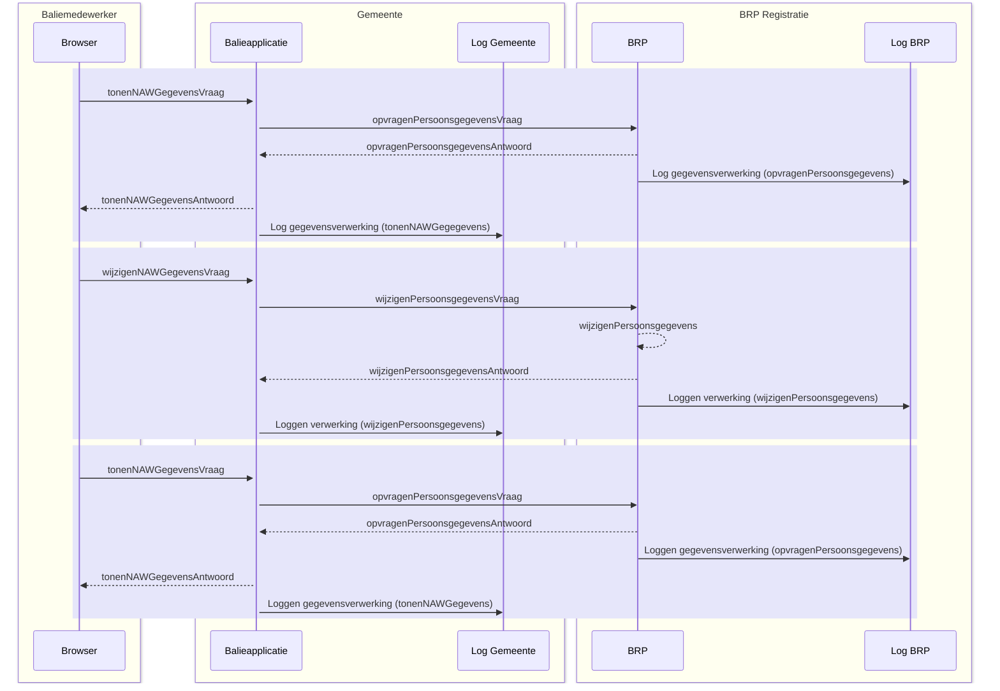

# Registratie Verhuizing - Eenvoudig, traditioneel systeem

Deze case beschrijft de binnengemeentelijke verhuizing van een persoon. De
beschrijving is functioneel zo eenvoudig mogelijk. De burger komt aan de balie
en er is geen sprake van meeverhuizende gezinsleden.

## Uitgangspunten

- Het beschreven proces is een voorbeeld, het werkelijke proces kan anders
  verlopen.
- Het proces is een 'happy flow', dit betekent dat validaties en eventuele
  foutsituaties in dit voorbeeld niet in ogenschouw worden genomen.
- Autorisatieprocessen zijn in dit voorbeeld niet meegenomen.
- Een Loggingsregel wordt toegevoegd aan het logboek per **geheel** afgeronde
  transactie. Er wordt dus **geen** aparte logregel aangemaakt per ontvangen of
  verstuurd bericht.

## Globaal proces

Schematisch ziet dit proces er als volgt uit:

1. De Baliemedewerker voert BSN van de burger in.
2. De Browser vraagt om persoonsdata bij de gemeentelijke Balieapplicatie.
3. De gemeentelijke Balieapplicatie vraag persoonsdata bij het BRP-systeem.
4. Het BRP systeem stuurt gevraagde data naar de gemeentelijke Balieapplicatie
   en logt de aanvraag.
5. De gemeentelijke Balieapplicatie stuurt de data naar de Browser en worden
   getoond aan de Baliemedewerker. De aanvraag wordt gelogd door de
   Balieapplicatie.
6. De Baliemedewerker voert de wijziging in en de Browser verstuurt de data naar
   de gemeentelijke Balieapplicatie.
7. De gemeentelijke Balieapplicatie verstuurt de data naar het BRP-systeem.
8. Het BRP-systeem verwerkt de wijziging, stuurt bevestiging terug naar de
   gemeentelijke Balieapplicatie en logt de verwerkingsactie.
9. De Browser vraagt de actuele persoonsdata op de gemeentelijke
   Balieapplicatie.
10. De gemeentelijke Balieapplicatie vraagt de persoonsdata op bij het
    BRP-systeem.
11. Het BRP-systeem stuurt de persoonsdata naar de gemeentelijke Balieapplicatie
    en logt de aanvraag.
12. De gemeentelijke Balieapplicatie stuurt de persoonsdata naar de Browser en
    logt de aanvraag.

Schematisch ziet dit proces er als volgt uit:

## Logging van data

De volgende data worden gelogd in de diverse logmomenten:

- **Log opvragenPersoonsgegevens (log BRP)**

  | Attribuut                   | Waarde                               |
  | --------------------------- | ------------------------------------ |
  | `span_id`                   | 7a22eb38-bca6-463f-9955-54ab040287cb |
  | `name`                      | opvragenPersoonsgegevens             |
  | `parent_span_id`            | `<leeg>`                             |
  | `trace_id`                  | c6adf4df949d03c662b53e95debdc411     |
  | `start_time`                | 2024-07-29 08:16:49.000              |
  | `end_time`                  | 2024-07-29 08:16:49.000              |
  | `status_code`               | OK                                   |
  | resource.name               | BRP                                  |
  | resource.version            | 2.0                                  |
  | attributeKey                | `dpl.core.processing_activity_id`    |
  | attributeValue              | 12f2ec2a-0cc4-3541-9ae6-219a178fcfe4 |
  | attributeKey                | `<leeg>`                             |
  | attributeValue              | `<leeg>`                             |
  | `foreign_operation.span_id` | b2e339a595246e01                     |

- **Log tonenNAWGegevens (log gemeente)**

  | Attribuut        | Waarde                               |
  | ---------------- | ------------------------------------ |
  | `span_id`        | b2e339a595246e01                     |
  | `name`           | tonenNAWGegevens                     |
  | `parent_span_id` | `<leeg>`                             |
  | `trace_id`       | c6adf4df949d03c662b53e95debdc411     |
  | `start_time`     | 2024-07-29 10:16:49.690              |
  | `end_time`       | 2024-07-29 10:16:49.723              |
  | `status_code`    | OK                                   |
  | resource.name    | Balieapp                             |
  | resource.version | 1.0.5                                |
  | attributeKey     | `dpl.core.processing_activity_id`    |
  | attributeValue   | 11x2ec2a-0774-3541-9b16-21ba179fcf15 |
  | attributeKey     | `dpl.core.data_subject_id`           |
  | attributeValue   | 13j2ec27-0cc4-3541-9av6-219a178fcfe5 |

- **Log wijzigenPersoonsgegevens (log BRP)**

  | Attribuut                   | Waarde                               |
  | --------------------------- | ------------------------------------ |
  | `span_id`                   | 433f276975204ccf                     |
  | `name`                      | wijzigenPersoonsgegevens             |
  | `parent_span_id`            | `<leeg>`                             |
  | `trace_id`                  | c6adf4df949d03c662b53e95debdc411     |
  | `start_time`                | 2024-07-29 08:17:02                  |
  | `end_time`                  | 2024-07-29 08:17:02                  |
  | `status_code`               | OK                                   |
  | resource.name               | BRP                                  |
  | resource.version            | 2.0                                  |
  | attributeKey                | `dpl.core.processing_activity_id`    |
  | attributeValue              | 8c714e4a-a538-36f7-8b1f-37a6884cc68c |
  | attributeKey                | `<leeg>`                             |
  | attributeValue              | `<leeg>`                             |
  | `foreign_operation.span_id` | 414514cf1d40d6b2                     |

- **Log wijzigenPersoonsgegevens (log gemeente)**

  | Attribuut                   | Waarde                               |
  | --------------------------- | ------------------------------------ |
  | `span_id`                   | 414514cf1d40d6b2                     |
  | `name`                      | wijzigenPersoonsgegevens             |
  | `parent_span_id`            | `<leeg>`                             |
  | `trace_id`                  | c6adf4df949d03c662b53e95debdc411     |
  | `start_time`                | 2024-07-29 08:17:02.000              |
  | `end_time`                  | 2024-07-29 08:17:02.000              |
  | `status_code`               | OK                                   |
  | resource.name               | Balieapp                             |
  | resource.version            | 1.0.5                                |
  | attributeKey                | `dpl.core.processing_activity_id`    |
  | attributeValue              | 19u2dd2a-0cb7-3541-9ae6-217a178fc9e6 |
  | attributeKey                | `dpl.core.data_subject_id`           |
  | attributeValue              | 13j2ec27-0cc4-3541-9av6-219a178fcfe5 |
  | `foreign_operation.span_id` | `<leeg>`                             |

- **Log opvragenPersoonsgegevens (log BRP)**

  | Attribuut                   | Waarde                               |
  | --------------------------- | ------------------------------------ |
  | `span_id`                   | 7a95b6989d2b28c7                     |
  | `name`                      | opvragenPersoonsgegevens             |
  | `parent_span_id`            | `<leeg>`                             |
  | `trace_id`                  | c6adf4df949d03c662b53e95debdc411     |
  | `start_time`                | 2024-07-29 08:17:02.000              |
  | `end_time`                  | 2024-07-29 08:17:02.000              |
  | `status_code`               | OK                                   |
  | resource.name               | BRP                                  |
  | resource.version            | 2.0                                  |
  | attributeKey                | `dpl.core.processing_activity_id`    |
  | attributeValue              | 0b1ff20a-3ecb-34bf-8cf5-e4cbacb046ab |
  | attributeKey                | `dpl.core.data_subject_id`           |
  | attributeValue              | `<leeg>`                             |
  | `foreign_operation.span_id` | df524ee2a3fd5ddf                     |

- **Log tonenNAWGegevens (log gemeente)**

  | Attribuut                   | Waarde                               |
  | --------------------------- | ------------------------------------ |
  | `span_id`                   | df524ee2a3fd5ddf                     |
  | `name`                      | tonenNAWGegevens                     |
  | `parent_span_id`            | `<leeg>`                             |
  | `trace_id`                  | c6adf4df949d03c662b53e95debdc411     |
  | `start_time`                | 2024-07-29 10:17:02.010              |
  | `end_time`                  | 2024-07-29 10:17:02.039              |
  | `status_code`               | OK                                   |
  | resource.name               | Balieapp                             |
  | resource.version            | 1.0.5                                |
  | attributeKey                | `dpl.core.processing_activity_id`    |
  | attributeValue              | 12c21c2a-0875-3543-9b16-21ja179fcf16 |
  | attributeKey                | `dpl.core.data_subject_id`           |
  | attributeValue              | 13j2ec27-0cc4-3541-9av6-219a178fcfe5 |
  | `foreign_operation.span_id` | `<leeg>`                             |

## Relatie tussen data

Om uiteindelijk alle data te kunnen rapporteren, is het van belang dat data op
een bepaalde manier aan elkaar gekoppeld zijn. In dit voorbeeld is de data op de
volgende manier gekoppeld:

## Relatie met de standaard Logboek dataverwerkingen

De relatie met de doelstellingen die gesteld zijn in de standaard Logboek
dataverwerkingen worden, op basis van dit voorbeeld, als volgt concreet
gerealiseerd:

- **het wegschrijven van logs van dataverwerkingen:** In dit voorbeeld is het de
  Baliemedewerker die via een Balieapplicatie de data van een Betrokkene kan
  bekijken en wijzigen. Deze acties zijn dataverwerkingen en worden gelogd bij
  zowel de Balieapplicatie als bij het BRP-systeem.
- **het aan elkaar relateren van logs van dataverwerkingen:** Er zijn in dit
  voorbeeld twee applicaties nodig om het totaal aan gevraagde informatie te
  kunnen tonen aan de betrokkene. Beide applicaties hebben een logboek voor
  verwerkte data. Om een totaalbeeld van de gelogde data te kunnen construeren,
  is een relatie tussen de logs nodig. In dit voorbeeld wordt de koppeling
  gelegd door het `span_id` en `trace_id` (gemeentelogboek) te linken aan het
  `foreign_operation.span_id` (BRP-logboek).
- **het aan elkaar relateren van dataverwerkingen over de grenzen van
  systemen:** Naast het koppelen van logs van diverse applicaties, wordt ook een
  koppeling gelegd met het Register van verwerkingsactiviteiten. Dit gebeurt per
  applicatie op basis van het `processing_activity_id` (register) te koppelen
  aan `dpl.core.processing_activity_id` (logboek). De diverse registers hebben
  **geen** directe koppeling met elkaar.

Standaard Logverwerkingen: **paragraaf 3.3.1 Gedrag**

1. _De applicatie MOET een Trace starten voor iedere Dataverwerking waarvan nog
   geen Trace bekend is._ Bij elke start van een verwerking wordt een `trace_id`
   aangemaakt. Bijvoorbeeld: in het voorbeeld komt er een bericht binnen bij de
   Balieapplicatie van de gemeente (tonenNAWGegevens). Er wordt direct een
   `trace_id` aangemaakt.
2. _De applicatie MOET voor iedere Dataverwerking een logregel wegschrijven in
   een Logboek. Log Sampling is niet toegestaan._ Een dataverwerking wordt
   opgeslagen als deze volledig is afgerond. In het voorbeeld is te zien dat een
   logregel wordt geschreven op het moment dat de vraag- en het antwoordbericht
   zijn afgerond.
3. _De applicatie MOET bijhouden of een Dataverwerking geslaagd of mislukt is en
   dit per Dataverwerking als status meegeven aan het Logboek._ Bij elke
   logregel in het voorbeeld staat de `status_code` vermeld ('OK').
4. _Als een Dataverwerking meerdere Betrokkenen heeft dan MOET de applicatie
   voor iedere betrokkene een aparte logregel wegschrijven. Een logregel kan
   naar 0 of 1 betrokkenen verwijzen._ In het voorbeeld gaat het om één
   betrokkene (`dpl.core.data_subject_id`), er wordt steeds één logregel
   aangemaakt.
5. _Als een applicatie aangeroepen kan worden vanuit een andere applicatie MOET
   de applicatie Trace Context metadata accepteren bij een dergelijke aanroepen
   deze metadata kunnen omzetten naar een foreign_operation bericht._ Bij een
   externe verwerking (bijvoorbeeld opvragenPersoonsgegevens) geeft de
   Balieapplicatie de `trace_id` en `span_id` mee aan het BRP-systeem. Het
   BRP-systeem registreert de `trace_id`, en `span_id` als
   `foreign_operation.span_id`.