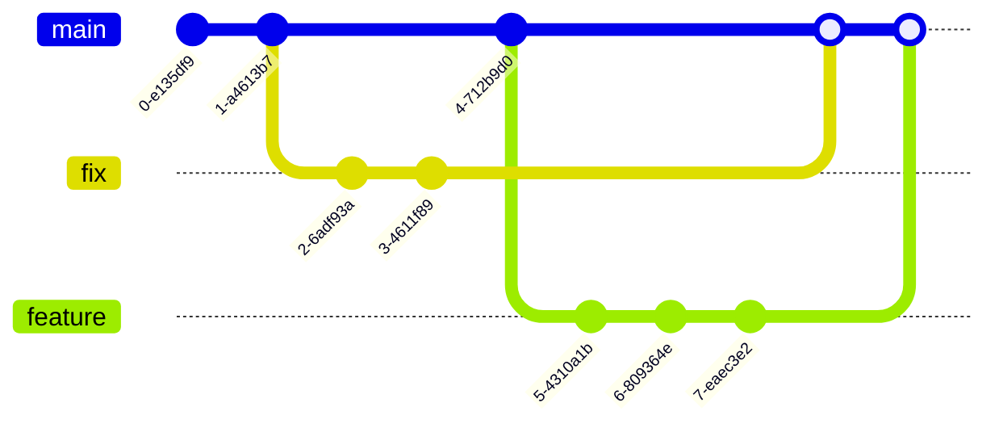

# Open Source werken met Gitflow

Wat is Git? Git is een versiebeheersysteem (Version Control System). Maar wat is
dat precies?

Stel: je werkt aan een set van documenten. Deze documenten heb je in een mapje
(directory, folder) op je laptop staan. Op een gegeven moment heb je een versie
die klopt. De samenhang is goed. De verwijzingen onderling zijn goed. Je wilt
die versie wel even bewaren voordat je er in verder gaat werken. Daarom maak je
een _kopie_ van de collectie van bestanden. Het gemakkelijkste daarvoor is een
kopie van de map te maken waar de hele collectie van bestanden in zit.
Vervolgens werk je verder en af en toe vergelijk je de nieuwe versie met de
vorige versie. Of zelfs vorige versies ...

## Commit

Dit is precies de functionaliteit die Git biedt! Zo'n kopie bewaren heet een
**git commit**. Je 'commit' bevat al je wijzigingen die je op dat moment hebt
opgespaard. Vervolgens biedt Git je vele mogelijkheden om te vergelijken
(_diff_), samen te voegen (_merge_), met verschillende kopieën naast elkaar door
te werken (_branch_), etc, etc.

## Branches

Er zijn hele workflows om Git heen ontstaan, die helpen om bijdragen op een
goede manier te reviewen, te accepteren en samen te voegen in de volgende versie
van de verzameling documenten (of code). Dat komt omdat Git zeer uitgebreid is
in het werken met **branches**. Zo'n branch is een parallelle kopie waarin
wijzigingen als commits kunnen worden gedaan en bewaard. Hoewel dat technisch
niet noodzakelijk is, is het gebruikelijk om één branch tot `master` of `main`
branch te 'verheffen'. Dit is de belangrijkste branch waar alles van afgeleid
wordt en alles in samenkomt.

Een branching workflow met Git ziet er dan (bijvoorbeeld) als volgt uit:

## Git repo

Een verzameling bestanden, documenten (of broncode) wordt in Git beheerd in een
Git **repository**, ook wel afgekort naar _Git repo_. Git biedt uitgebreide
mogelijkheden om repositories decentraal te beheren en om vervolgens wijzigingen
(commits) uit te wisselen. Er is technisch geen centrale opslag of server nodig
... maar voor de samenwerking met mensen is dat wél nodig 😄 Dit wordt vaak de
_Git hub_ genoemd; de hub tussen alle decentraal beheerde repo's (repositories).
De bekendste 'smaken' voor deze centrale service zijn: **GitHub** en **GitLab**.

GitHub en GitLab (en vele alternatieven) bieden allerlei ondersteuning via het
web. Zoals gezegd heeft Git sublieme mogelijkheden om in _branches_ parallel te
kunnen werken. Parallel betekent in deze dat mensen parallel kunnen werken, maar
ook dat versies of documenten met verschillende aandachtsgebieden parallel
kunnen worden ontwikkeld. GitHub/GitLab biedt dan vervolgens ondersteuning in
het review proces en de _merge_ van zo'n parallelle branch in het 'hoofd
product', de `main` branch. Dit heet een **Pull Request** (in GitHub) of **Merge
Request** (in GitLab). Zo'n Pull/Merge Request geeft een goed inzicht in wat er
veranderd is, wat er toegevoegd wordt, wat er verwijderd wordt. Het biedt ook
mogelijkheden om commentaar te geven in het review proces. En dit alles
inzichtelijk en gedetailleerd. Het niveau van detail kan zelfs wel overweldigend
ervaren worden 😉

## Contributies

In GitHub en GitLab zijn de personen die rechten hebben om direct wijzigingen te
doen, de **Core Committers**. Dit zijn de beheerders en redacteuren van de
inhoud van de _Git repo_. Voor contributies van deze Core Committers maken zij
gebruik van branches tbv het verzamelen van wijzigingen en het review proces en
acceptatie met een Pull/Merge Request.

Als de Git repo openbaar toegankelijk is, kunnen anderen ook bijdragen,
contributies aanleveren. Dat werkt op vergelijkbare manier als de _branching_
hierboven al beschreven. Voor personen die niet direct wijzigingen kunnen
aanbrengen, zit er een extra stap tussen. Dat heet _forking_.

Een **fork** is een kopie van een branch uit de oorspronkelijke Git repo,
meestal de `main` branch. Deze kopie wordt 'eigendom' van de persoon of
organisatie waaronder de fork geplaatst wordt. Dat betekent dat daar een nieuwe
groep van Core Committers bestaat. Daar worden wijzigingen gedaan binnen het
regime en voorwaarden van die groep. Vervolgens kan vanuit een fork, net zoals
uit een normale branch, een Pull/Merge Request worden gemaakt richting het
originele project / Git repo. Als deze geaccepteerd wordt, blijven usernames en
commits bestaan. Daarmee worden deze (externe) personen die dus niet direct
rechten hebben op de (oorspronkelijke) Git repo, **Contributors**.

De 'buitenste' ring van personen om een open source project / Git repo heen,
zijn de gebruikers / Users. Deze kunnen gebruik maken van (openbare) open source
software en documentatie en onbekend blijven of participeren in de omliggende
community dmv vragen stellen, antwoorden geven, interacties. Op dat moment
worden deze gebruikers ook wel Contributors genoemd, maar zonder toegevoegde
wijzigingen.