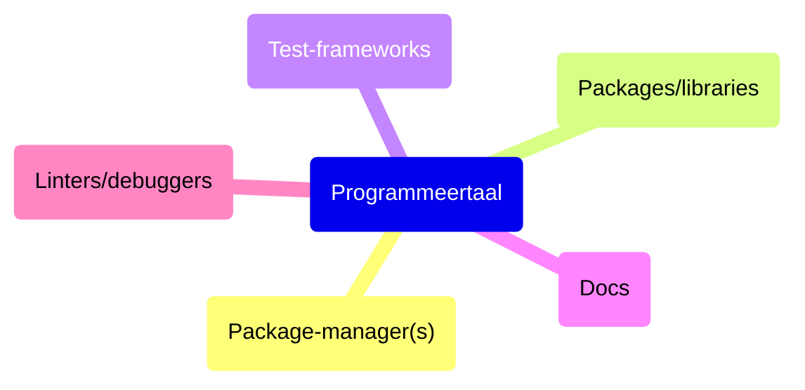

# Programmeertalen

Het kiezen van een programmeertaal voor een project is een belangrijke keuze met
consequenties. Het heeft bijvoorbeeld invloed op hoe snel er ontwikkeld kan
worden, en wat voor soort libraries er voor handen zijn. Veelal wordt de taal
gekozen op basis van welke kennis er in het team is maar meer nuance is op z'n
plek.

## Elke taal een andere geschiedenis

Elke programmeertaal komt met bepaalde voordelen en heeft specifieke use-cases
waar hij goed in is. Zo heeft **JavaScript** bijvoorbeeld veel libraries voor
het bouwen van API's doordat het een taal is die groot geworden is op het web.
Een taal als **Python** een grote userbase in de wetenschappelijke wereld
waardoor het een schat aan libraries voor het analyseren van data. Een taal als
**Java** onderscheid zich op zijn betrouwbaarheid en backwards-compatibiliteit.

Programmeertalen onderscheiden zich op de volgende punten:

## Ecosysteem



Wat wordt er mee geleverd? Elk ecosysteem komt met z'n eigen voordelen.

Binnen een ecosysteem kan je verschillende deelproducten onderscheiden:

- Package managers
- Docs omgevingen
- Compilers
- Linters (bv. Clippy in Rust)
- Testing frameworks (bv. pytest in Python)
- IDE's
- Andere tooling

## Filosofie

Elke programmeertaal heeft z'n eigen filosofie van waaruit deze wordt
doorontwikkeld. Zo is Go gebaseerd op het idee dat eenvoud belangrijker is dan
slimmigheidjes (meer expressie in de taal) - en zitten er expres zo min mogelijk
features in de taal. Dit moet leiden tot duidelijkere code en performantere
teams. Deze filosofie is terug te brengen naar de volgende qoute:

"Clear is better than clever"

Dit is een quote die veel gebruikt wordt in de Go community.

## Strongly typed, weakly typed

Ook een belangrijk onderscheid binnen talen zijn de strongly typed en weakly
typed talen. Ook al kan je dit ook zien als een spectrum waarop je striktere
talen hebt aan de ene kant (Rust), en aan de andere kant JavaScript.

### JavaScript: uitgesproken weakly typed

JavaScript kenmerkt zich door het feit dat het heel makkelijk is om een nieuwe
waarde aan een variabele toe te kennen:

```js
let userAge = 25; // Number
console.log(userAge * 2); // 50 - werkt prima

userAge = "twenty-five"; // Nu ineens een String!
console.log(userAge * 2); // NaN - kapot, maar geen error

userAge = { years: 25 }; // Nu een Object!
console.log(userAge * 2); // NaN - weer kapot

userAge = [25]; // Nu een Array!
console.log(userAge * 2); // 50 - werkt "toevallig" weer?!
```

### Rust: uitgesproken strongly typed

```Rust
fn main() {
    let mut age = 25;              // i32 (integer)
    println!("Age: {}", age);      // 25

    age = 30;                      // OK - nog steeds i32
    println!("Age: {}", age);      // 30

    // Nu proberen we het type te veranderen:
    age = "30";                    // COMPILE ERROR!
    // ERROR: expected integer, found `&str`
    // ERROR: mismatched types

    age = 30.5;                    // COMPILE ERROR!
    // ERROR: expected `i32`, found floating-point number

    age = String::from("thirty");  // COMPILE ERROR!
    // ERROR: expected `i32`, found `String`
}
```

## Conclusie

Elke taal heeft z'n eigen voor- en nadelen. Een striktere taal is minder
vergevingsgezind en vermoedelijk kost het in eerste instantie meer tijd om hier
mee te leren werken. Dit betaalt zich uiteindelijk weer terug in betere error
handling.

### Strikte talen voorkomen tech debt bij complexe projecten

Het voordeel van strong typed talen is dat je er tech-debt mee voorkomt. Het
nadeel is dat de learning curve ervan steiler is en dat development er trager
door kan gaan. De uitruil die je dus zou kunnen waarnemen is die tussen
development-snelheid en de kwaliteit van de software.

Hoe complexer het project wordt, hoe fijner het is dat je strong typed models
hebt opgesteld. Dit omdat het aantal features groeit, en de kans op regressies
(nieuwe bugs) ook groeit.

## Aan de slag!

<br />
<br />