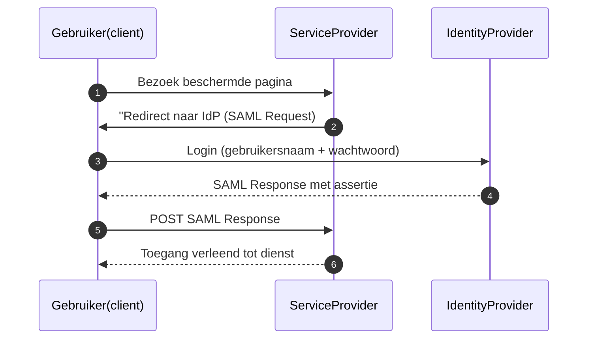

# SAML

**SAML (Security Assertion Markup Language)** is een open standaard voor
**federatieve authenticatie**. Het stelt gebruikers in staat om zich één keer
aan te melden (Single Sign-On) en daarna toegang te krijgen tot meerdere
diensten zonder opnieuw in te loggen.

SAML is XML-gebaseerd en wordt veel gebruikt in enterprise-omgevingen én bij
overheidsdiensten. De huidige standaard is **SAML 2.0**, ontwikkeld door
[OASIS](https://docs.oasis-open.org/security/saml/v2.0/).

## Hoe werkt SAML?

SAML regelt de communicatie tussen drie partijen:

1. **Gebruiker** (Subject)
2. **Identity Provider (IdP)** – verzorgt de authenticatie
3. **Service Provider (SP)** – biedt de dienst aan

Wanneer een gebruiker probeert in te loggen bij een SP, wordt hij doorgestuurd
naar de IdP. Na succesvolle login stuurt de IdP een zogeheten **SAML-assertie**
terug, waarmee de SP de gebruiker toegang geeft.

## Waar wordt SAML voor gebruikt?

SAML is de standaard bij veel publieke en private federatieve inlogsituaties,
waaronder:

- **eHerkenning** – zakelijke toegang tot overheidsdiensten in Nederland
- **DigiD** – burger inlog voorziening voor digitale overheidsdiensten
- **eIDAS** – Europese infrastructuur voor grensoverschrijdende digitale
  identiteit
- **Enterprise SSO** – toegang tot meerdere apps via één login, bv. Microsoft AD
  FS

## SAML in DigiD, eHerkenning en eIDAS

### DigiD

DigiD maakt gebruik van **SAML 2.0** voor authenticatie tussen dienstverleners
en de DigiD-infrastructuur. De dienstverlener treedt op als Service Provider,
Logius als Identity Provider.

Bron: [Logius.nl/digid](https://www.logius.nl/domeinen/toegang/digid)

### eHerkenning

Ook eHerkenning werkt met **SAML 2.0**. Het zorgt ervoor dat een gebruiker
namens een organisatie veilig kan inloggen bij verschillende
overheidsinstanties. Hierbij zijn meerdere IdP’s (leveranciers) mogelijk die via
SAML koppelen met SP’s (dienstverleners).

Bron: [eHerkenning.nl](https://www.eherkenning.nl/)

### eIDAS

Binnen de huidige eIDAS-infrastructuur gebruiken nationale eIDAS-nodes ook
**SAML 2.0** om identiteiten grensoverschrijdend te laten werken. Een
buitenlandse gebruiker logt in bij zijn nationale IdP, en deze stuurt een
SAML-response naar de SP in het andere land.

In eIDAS 2.0 wordt ook **OAuth/OpenID Connect** overwogen als modern
alternatief, maar SAML blijft voorlopig een kerncomponent.

Bron:
[eIDAS Technical Specs - Europa.eu](https://digital-strategy.ec.europa.eu/en/policies/eidas-regulation)

## 🧠 Waarom kiezen voor SAML?

- Bewezen en stabiele standaard
- Breed ondersteund bij overheden en grote organisaties
- Werkt goed voor browsergebaseerde flows
- Minder geschikt voor mobiele apps of API-authenticatie (daarvoor is OAuth
  beter)

## Meer informatie

- [SAML 2.0 Specificatie bij OASIS](https://docs.oasis-open.org/security/saml/v2.0/)
- [DigiD en SAML - Logius.nl](https://www.logius.nl/domeinen/toegang/digid)
- [eHerkenning en SAML - eherkenning.nl](https://www.eherkenning.nl/)
- [eIDAS en federatieve authenticatie](https://digital-strategy.ec.europa.eu/en/policies/eidas-regulation)

## Een typische SAML flow

Een typische SAML flow verloopt als volgt:

